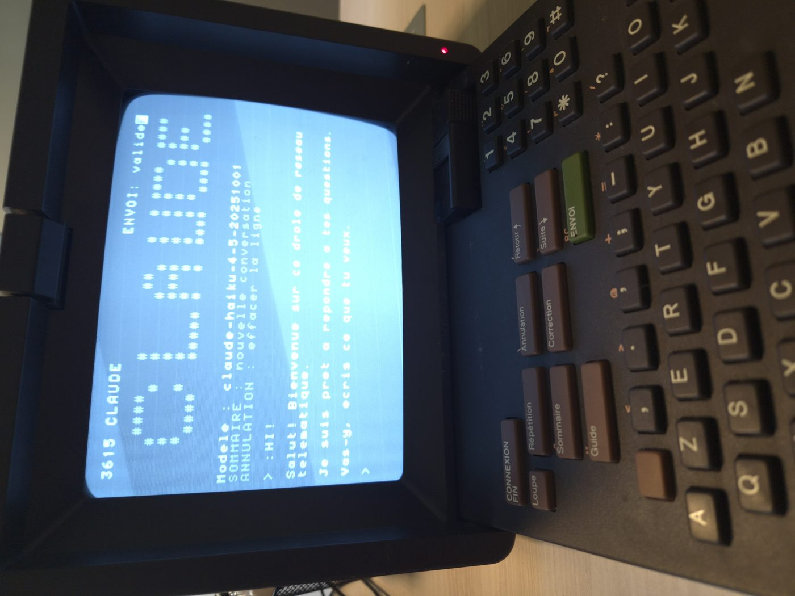

# 3615 IA

Une passerelle qui branche un vrai Minitel sur les grands modèles de langage.



```
Minitel 1B  --DIN-->  ESP32  --WiFi/WebSocket-->  3615 IA  --HTTP-->  LLM
```

Le Minitel affiche du Vidéotex à 1200 bauds sur 40 colonnes. Ce serveur fait la
traduction dans les deux sens : il encode les réponses du modèle en Vidéotex,
décode les touches du clavier, et cadence l'envoi pour ne pas noyer la liaison
série.

Fonctionne avec Anthropic, OpenAI, Mistral, Google, Groq, OpenRouter — et avec
**un modèle tournant sur votre réseau local** via Ollama, LM Studio ou
llama.cpp.

## Matériel

Un Minitel avec sa prise péri-informatique (DIN 5 broches) et un module ESP32
faisant le pont WebSocket. Le plus simple est le
[dongle Minitel-ESP32 d'iodeo](https://www.iodeo.fr/projets/minitel-esp32) :
il se branche sans soudure et se nourrit du Minitel. Le firmware doit disposer
d'un client WebSocket qui recopie les octets vers le port série — c'est le cas
des firmwares habituels de la communauté.

Aucune modification du Minitel n'est nécessaire.

## Installation

Node.js 20 ou plus récent.

```bash
git clone https://github.com/VOTRE-COMPTE/3615IA.git
cd 3615IA
npm install
cp services.example.json services.json
cp .env.example .env      # puis renseignez vos clés
```

Lancement :

```bash
node --env-file=.env src/server.mjs
```

Le serveur affiche au démarrage les services qu'il a retenus, ceux qu'il a
écartés faute de clé, et l'adresse d'écoute :

```
3615 IA
  configuration : /home/ubuntu/3615IA/services.json
  service       : CLAUDE (anthropic) claude-haiku-4-5-20251001
  service       : LOCAL (openai) llama3.2
  ecarte        : CHATGPT (OPENAI_API_KEY non definie)

  ecoute        : ws://0.0.0.0:8080/
  debit         : 1200 bauds
```

Il ne reste qu'à ajouter `ws://ADRESSE-DU-SERVEUR:8080/` dans la liste de
serveurs du firmware ESP32.

## Configuration des services

`services.json` est un tableau. Chaque entrée devient une ligne du menu affiché
sur le Minitel.

```json
{
  "nom": "CLAUDE",
  "kind": "anthropic",
  "model": "claude-haiku-4-5-20251001",
  "apiKeyEnv": "ANTHROPIC_API_KEY",
  "workspaceEnv": "ANTHROPIC_WORKSPACE_ID",
  "etiquette": "Anthropic"
}
```

| Champ | Rôle |
|---|---|
| `nom` | Affiché au menu, 16 caractères maximum |
| `kind` | `anthropic` ou `openai` (voir ci-dessous) |
| `baseUrl` | Racine de l'API ; obligatoire sauf pour les valeurs par défaut |
| `model` | Identifiant du modèle |
| `modelEnv` | Variable d'environnement qui peut surcharger `model` |
| `apiKeyEnv` | Variable contenant la clé ; omise pour un serveur local |
| `workspaceEnv` | Anthropic seulement, voir plus bas |
| `etiquette` | Texte secondaire au menu |
| `maxTokens` | 500 par défaut |
| `temperature` | Transmise telle quelle si présente |
| `actif` | `false` pour garder une entrée sans l'afficher |

Un service dont la clé est absente est simplement retiré du menu. Si un seul
service reste utilisable, le menu est sauté et le Minitel entre directement en
conversation.

Les identifiants de modèles de `services.example.json` vieillissent vite :
vérifiez-les dans la documentation de chaque fournisseur.

### Les deux protocoles

`anthropic` parle à `/v1/messages` avec les en-têtes `x-api-key` et
`anthropic-version`.

`openai` parle à `/v1/chat/completions` avec `Authorization: Bearer`. Ce format
est devenu le dénominateur commun : il couvre OpenAI, Mistral, Groq,
OpenRouter, DeepSeek, Together, l'endpoint de compatibilité de Gemini, et les
serveurs locaux. Pour ajouter un fournisseur, il suffit en général d'une entrée
avec le bon `baseUrl`.

### Modèle local

Aucune clé, aucun code spécifique — juste une URL.

**Ollama** (`ollama serve`, port 11434) :

```json
{ "nom": "LOCAL", "kind": "openai",
  "baseUrl": "http://127.0.0.1:11434/v1", "model": "llama3.2" }
```

**LM Studio** (serveur local, port 1234) :

```json
{ "nom": "LOCAL", "kind": "openai",
  "baseUrl": "http://127.0.0.1:1234/v1", "model": "votre-modele" }
```

**llama.cpp** (`llama-server`, port 8080 par défaut — pensez à changer le port
de 3615 IA pour éviter la collision) :

```json
{ "nom": "LOCAL", "kind": "openai",
  "baseUrl": "http://127.0.0.1:8080/v1", "model": "nimporte" }
```

Si le serveur LLM tourne sur une autre machine du réseau, remplacez `127.0.0.1`
par son adresse et vérifiez qu'il écoute bien sur toutes les interfaces
(`OLLAMA_HOST=0.0.0.0` pour Ollama).

Un modèle local est le compagnon naturel du Minitel : tout reste chez vous, et
un 7B quantifié génère largement plus vite que 120 caractères par seconde.

### Clé Anthropic et espace de travail

Une clé Anthropic liée à une identité et donnant accès à plusieurs espaces de
travail doit indiquer l'espace cible, sinon l'API répond
`400 invalid_request_error`. Deux solutions : créer la clé en la limitant à un
seul espace de travail, ou renseigner `ANTHROPIC_WORKSPACE_ID` (visible dans la
Console, Settings → Workspaces, sous la forme `wrkspc_...`).

## Touches du Minitel

| Touche | Effet |
|---|---|
| **Envoi** | Valider la saisie |
| **Correction** | Effacer le dernier caractère |
| **Annulation** | Effacer la ligne, ou interrompre une réponse en cours |
| **Sommaire** | Retour au menu des services |
| **Guide** | Rappel des touches |

## Variables d'environnement

| Variable | Défaut | Rôle |
|---|---|---|
| `PORT` | `8080` | Port d'écoute WebSocket |
| `HOST` | `0.0.0.0` | Interface d'écoute |
| `BAUDS` | `1200` | Débit réel du port DIN, sert à cadencer l'envoi |
| `SERVICES` | — | Chemin d'un `services.json` alternatif |
| `MAX_TOURS` | `12` | Nombre de messages conservés dans l'historique |

Plus les variables citées par `apiKeyEnv` et `modelEnv` dans votre
configuration.

## Détails d'implémentation

**Encodage.** Le Minitel n'est pas en UTF-8. Un `é` s'écrit `SS2` + accent +
lettre, soit `0x19 0x42 0x65`. Le texte est normalisé en NFD, ce qui fait
apparaître les diacritiques comme caractères combinants et colle exactement au
modèle Vidéotex. Les caractères hors du jeu (emoji, CJK) sont supprimés, les
apostrophes typographiques ramenées en ASCII.

**Cadencement.** À 1200 bauds, la liaison n'avale que 120 octets par seconde.
Envoyer plus vite fait déborder le tampon UART de l'ESP32 : octets perdus,
séquences `SS2` tronquées, affichage corrompu. Le serveur lisse donc son débit
sur la valeur de `BAUDS`. Si votre firmware négocie le port à 4800, réglez
`BAUDS=4800` et l'affichage sera quatre fois plus rapide.

**Découpage du flux.** Sur 40 colonnes, on ne sait où couper une ligne qu'une
fois le mot complet reçu. Le découpeur n'émet une ligne que lorsqu'il est
certain que rien de plus n'y tiendra, et conserve la queue telle quelle,
espaces finaux compris, pour que les fragments du flux se recollent proprement.

**Écho.** L'écho local du Minitel est coupé par une commande PRO3 et le serveur
réaffiche lui-même les caractères tapés, ce qui lui laisse la maîtrise du
curseur. Si chaque caractère s'affiche en double sur votre modèle, remplacez
`ECHO_OFF` par `ECHO_OFF_ALT` dans `src/videotex.mjs`.

**Format des réponses.** Un modèle qui répond en markdown avec des tableaux est
illisible sur 40 colonnes. Le prompt système impose du texte brut, des phrases
courtes et huit lignes maximum. Il est en tête de `src/server.mjs`.

## Tests

```bash
npm test
```

Monte un faux backend SSE et un faux Minitel, puis vérifie l'encodage des
accents, l'écho clavier, le respect des 40 colonnes et la préservation des
espaces aux jointures du flux. Aucun accès réseau, aucune clé nécessaire.

## Service systemd

```bash
sudo cp systemd/3615ia.service /etc/systemd/system/
sudo install -m 600 /dev/null /etc/3615ia.env
sudo nano /etc/3615ia.env          # vos clés
sudo systemctl enable --now 3615ia
journalctl -u 3615ia -f
```

Un service systemd n'hérite pas de votre shell : les clés doivent être dans le
fichier d'environnement, pas dans un `export`.

## Sécurité

Le serveur est ouvert et sans authentification. Vos clés d'API restent côté
serveur et ne transitent jamais vers le Minitel, mais n'importe qui connaissant
l'adresse peut consommer vos crédits. Sur une machine exposée, restreignez
l'accès par pare-feu, ou placez un reverse proxy devant.

La liaison est en clair. Le TLS fonctionne sur ESP32 mais alourdit la poignée
de main ; si vous y tenez, un nginx en `wss://` devant le serveur fait
l'affaire, à condition que votre firmware accepte le certificat.

## Remerciements

Le dongle [Minitel-ESP32](https://github.com/iodeo/Minitel-ESP32) d'iodeo, sans
lequel rien de tout cela ne serait branchable. Et
[MiniPavi](https://www.minipavi.fr/), qui garde la télématique en vie.

## Licence

MIT.
